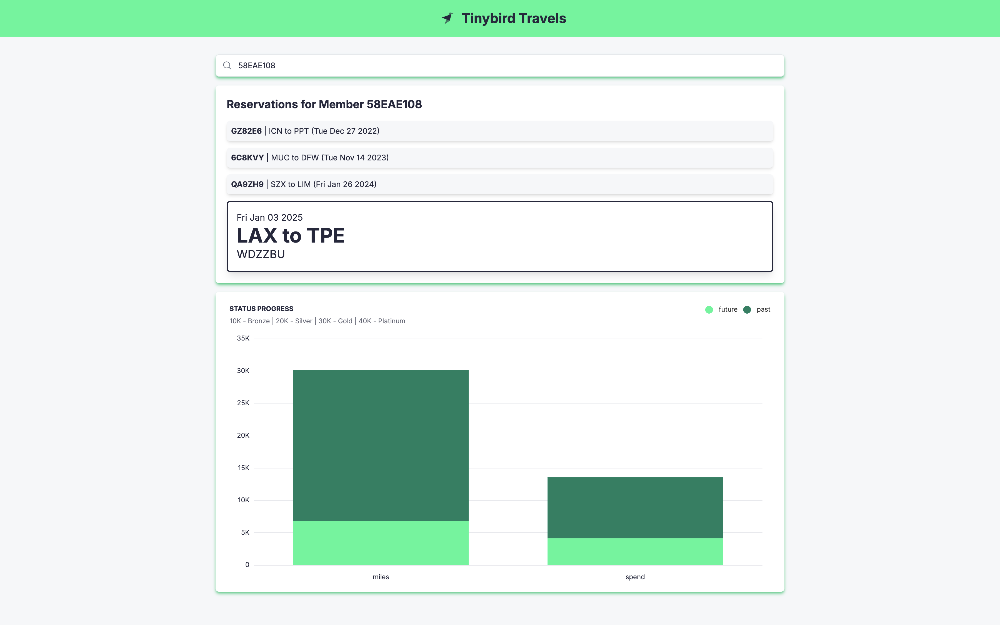

# Airline Loyalty Program Demo
This is a [Next.js](https://nextjs.org) project bootstrapped with [`create-next-app`](https://nextjs.org/docs/app/api-reference/cli/create-next-app).

This repo accompanies the Tinybird + DynamoDB **Secondary Indexes** and **Filtering and Aggregation** blog posts.

### Use Case
Customer loyalty is earned through recognition and rewards. This demo aims to help the fictional airline "Tinybird Travels" to do that.

After setting up the data and enabling queries by reservation and member,  aggregations will help determine airline status. This functionality benefits both members who want to view their flights and airline support staff who need to provide assistance to their valued customers.




### Prerequisites
- An AWS account with access to [DynamoDB](console.aws.amazon.com/dynamodbv2), [IAM](console.aws.amazon.com/iam), and [S3](console.aws.amazon.com/s3)
- A [free Tinybird account](https://tinybird.co/signup)
- Node.js >= v20.15.0
- Next.js >= v14.2.13

## DynamoDB
### Create AirlineReservation Table in DynamoDB
- From [DynamoDB](console.aws.amazon.com/dynamodbv2), select **Create table**
- **Table name**: AirlineReservation
- **Partition key**: RecordLocator
- **Sort key**: ActivityDateTime

### Create User for DynamoDB
- From [IAM](console.aws.amazon.com/iam), go to Users, then select **Create user**
- Give it a name, then select **Attach policies directly** to set permissions
- Search for **AmazonDynamoDBFullAccess** and select it to attach
- Finish creating the user and save the user access keys

### Seed the AirlineReservation Table
Open this project in VS Code or editor of choice.

Open a new terminal and
- Install the dependencies
```bash 
npm i
```
- Create a new file `.env.local` in the project's root directory
```bash
cp .env.example .env.local
```
- Update AWS_ACCESS_KEY_ID, AWS_SECRET_ACCESS_KEY, and AWS_REGION
- Run the seed script from the project's root directory
```bash
node seed.mjs
```

*Note*: The `seed.mjs` file will generate 50 reservations at a time. Feel free to update the number or run it multiple times.

### Create Global Secondary Index
Once the table is populated with some data, items can be explored from the table in [DynamoDB](console.aws.amazon.com/dynamodbv2).

When querying, the partition key RecordLocator and the sort key ActivityDateTime are the only attributes that can be defined.

Looking up a particular reservation is great, but it would also be nice to view all reservations for a particular member and sort by flight date.

A global secondary index (GSI) can be created to perform queries on attributes that are not part of a table's primary key.

- From the table view, go to the **Indexes** tab and then select **Create index**
- **Partition key**: MemberId
- **Sort key**: FlightDate
- **Index name**: MemberId-FlightDate-index
- **Attribute projections**: Include
- **Attribute name**: RecordLocator, DestinationAirport

*Note*: Projections are attributes copied from the table into the secondary index. To minimize cost and latency, limit the attributes projected.

Once the GSI is created, it can be used to query the table. Now it's easy and efficient to search by record locator or member id.

### Turn on backups and streams
While in the AirlineReservation table in DynamoDB, update settings that Tinybird will need later.
- Turn on Point-in-time recovery from the **Backups** tab
- Turn on DynamoDB streams from the **Exports and streams** tab

## Tinybird
DynamoDB is great for performance at scalability and security of simple reads and writes, but it isn't best suited for complex queries and analytics.

That's where Tinybird comes in.

### Create a workspace
- Login into [Tinybird](https://app.tinybird.co/)
- Select an AWS region
- Create a workspace called **airline_loyalty_program**
- Update `.env.local` with the admin token from **Tokens** and the correct API base URL for the selected [region](https://www.tinybird.co/docs/api-reference/overview#regions-and-endpoints)


### Add a DynamoDB Data Source
From the new Tinybird workspace, create a new Data Source and select DynamoDB. This will start a wizard to establish a connection between Tinybird and DynamoDB. There are a few steps between Tinybird and AWS, but the wizard is easy to follow.

Check out the docs for more info about the [Tinybird DynamoDB Connector](https://www.tinybird.co/docs/ingest/dynamodb)

Once the connection is established, run `seed.mjs` a few more times to test that DynamoDB is streaming and Tinybird is ingesting properly.

### Create and publish a Pipe
- Select **Create Pipe** from the DynamoDB Data Source
- Name the pipe **get_reservations**
- Copy the following SQL into the first node
```sql
SELECT * FROM dynamodb_airline_reservation
WHERE RecordLocator={{String(search_value, '')}} OR
MemberId={{String(search_value, '')}}
```
- Run the node and rename it to **endpoint**
- Click **Create API Endpoint**

Now that the endpoint is published, reservations can be searched by record locator or member id from the Next.js app.

From the terminal in the project's root directory run the following command:
```bash
npm run dev
```

Then open [http://localhost:3000/dashboard](http://localhost:3000/dashboard) in a browser. Try searching for some record locators and member ids.

## Adding analytics to the app
Now to have some fun.

To build loyal customers, let's offer rewards based on how much they spend and how far they fly.

### Add airport reference data
In Tinybird, create a new Data Source called **airports** that ingests from a Remote URL using this CSV file URL: https://data.opendatasoft.com/api/explore/v2.1/catalog/datasets/airports-code@public/exports/csv

## Aggregate stats
With airport reference data that includes coordinates, distance between airports can be calculated for each reservation. Along with miles, spend can be summed up, airports visited can be counted, and values can be split between past and future flights.

- Drag `/tinybird/pipes/aggregate_stats.pipe` over the Tinybird UI. This pipe has nodes that get reservatinos for a specific member, get coordinates for each airport, calculate the distance between airports, and sum up spend and miles for past and future flights.
- Create API Endpoint for the **endpoint** node

What other ways can the data be filtered and aggregated? Don't be afraid to be creative!

## Rewards progress
There is a lot that can be done with this use case.

Let's start with a simple chart that helps members see their status progress.

- Create a new pipe called **status_progress**
- In the first node, enter the following SQL and rename the node **endpoint**
```sql
SELECT 'miles' AS type, past_miles as past, future_miles as future FROM aggregate_stats
UNION ALL
SELECT 'spend' AS type, past_spend as past, future_spend as future FROM aggregate_stats
```
- Publish the **endpoint** node as an API
- Select **Create Chart**
- **Chart name**: Status Progress
- **Chart description**: 10K - Bronze | 20K - Silver | 30K - Gold | 40K - Platinum
- **Chart type**: Stacked Bar
- **Data index**: type
- **Data categories**: future, past
- **Show legend in chart**: checked
- Save the chart
- Copy the code and paste it into `app/components/charts.tsx`
- Update the code to allow passing in a member_id
```javascript
export function StatusProgress(params: {
    member_id?: string
}) {
  return (
    <BarChart
        params={params}
        // rest of your props
    />
})
```

Now a status progress chart will show under a member's list of reservations!

## Next Steps

There's so much more that can be added to enhance this demo such as
- Adding new reservations from the front end of the app
- Toggling between member and support views
- Adding more detailed customer information
- Creating alerts for when certain status milestones are passed
- Adding the ability to update or cancel a reservation
- Adding richer airport data and reporting
- Adding anonymized leaderboards
- Whatever else can be dreamt up!
